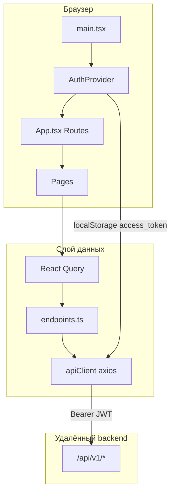

# AIAgentFront — сводка по проекту

> Документ сгенерирован по анализу репозитория (июнь 2026). Актуализируйте при существенных изменениях архитектуры или API.

## Назначение

**AIAgentFront** — веб-интерфейс корпоративной **платформы ИИ-агентов** («AI Agents»). Приложение даёт сотрудникам:

- вход по email/паролю (JWT);
- обзор доступных агентов и их прав (запуск, согласование, настройка);
- список задач оркестратора;
- семантический поиск по базе знаний (RAG);
- администрирование пользователей и подразделений (для суперпользователя);
- профиль и загрузку аватара;
- индикатор состояния backend в шапке.

Бекенд **не входит в этот репозиторий** — фронтенд общается с удалённым API (FastAPI). Локальный запуск бекенда в проекте не предусмотрен; деплой бекенда — отдельно (`deploy_backend.py` на сервере, PostgreSQL на том же сервере).

---

## Технологический стек

| Слой | Технологии |
|------|------------|
| UI | React 19, TypeScript 5.7, CSS (без UI-фреймворка) |
| Сборка | Vite 6, `@vitejs/plugin-react` |
| Маршрутизация | `react-router-dom` 6 |
| Данные / кэш | `@tanstack/react-query` 5 |
| HTTP | Axios |
| Контейнеризация | Docker multi-stage (dev → build → nginx) |

Ожидаемый стек бекенда (упоминается в UI): **FastAPI, JWT, PostgreSQL, Redis, Qdrant, MinIO**.

---

## Структура репозитория

```
AIAgentFront/
├── index.html              # SPA, lang=ru, title «Платформа ИИ-агентов»
├── package.json
├── vite.config.ts          # alias @ → src, proxy /api
├── tsconfig.json           # strict, paths @/*
├── Dockerfile              # deps → dev | build → nginx prod
├── .env.example
├── public/
│   └── robots.txt
└── src/
    ├── main.tsx            # QueryClient, Router, AuthProvider
    ├── App.tsx             # маршруты + ProtectedRoute
    ├── api/
    │   ├── client.ts       # axios + JWT interceptors
    │   └── endpoints.ts    # обёртки REST
    ├── auth/
    │   └── AuthContext.tsx
    ├── types/
    │   └── index.ts        # доменные типы TS
    ├── components/
    │   ├── Layout.tsx
    │   ├── Sidebar.tsx
    │   └── Topbar.tsx
    ├── pages/              # экраны по разделам
    └── styles/
        └── global.css
```

**Замечание:** `README.md` устарел (шаблон Create React App, скрипты `npm start` / порт 3000 не соответствуют Vite).

---

## Архитектура фронтенда



1. **Точка входа:** `QueryClientProvider` → `BrowserRouter` → `AuthProvider` → `App`.
2. **Авторизация:** токен в `localStorage` (`access_token`, опционально `token_expires_at`). Запросы к API получают заголовок `Authorization: Bearer …`. При 401 токен очищается.
3. **Защита маршрутов:** `ProtectedRoute` — пока идёт `auth/me`, показывается «Проверяем сессию…»; без сессии редирект на `/login`.
4. **Layout:** боковая навигация + topbar с health-check каждые 15 с.

---

## Маршруты и экраны

| Путь | Компонент | Описание | Доступ |
|------|-----------|----------|--------|
| `/login` | `Login` | Email + пароль | Публичный |
| `/` | `Dashboard` | Сводные счётчики, роль пользователя | Auth |
| `/agents` | `Agents` | Таблица агентов с правами | Auth |
| `/tasks` | `Tasks` | Задачи оркестратора | Auth |
| `/knowledge-base` | `KnowledgeBase` | RAG-поиск (`documents/search`) | Auth |
| `/documents` | `Documents` | Заглушка (MinIO/Qdrant) | Auth |
| `/users` | `Users` | CRUD пользователей | Только `is_superuser` |
| `/departments` | `Departments` | Список + создание | Создание — superuser |
| `/profile` | `Profile` | Профиль, аватар | Auth |
| `/monitoring` | `Monitoring` | Заглушка (/metrics) | Auth |

---

## REST API (клиент)

Базовый URL: `VITE_API_URL` или по умолчанию **`http://192.168.1.157:5454/api/v1`** (`src/api/config.ts`).

В dev Vite проксирует `/api` на `VITE_API_PROXY` (по умолчанию `http://192.168.1.157:5454`).

### Эндпоинты (`src/api/endpoints.ts`)

| Группа | Методы |
|--------|--------|
| `healthApi` | `GET /health` |
| `authApi` | `POST /auth/login`, `GET /auth/me`, `POST /auth/logout`, `POST /auth/register` |
| `usersApi` | `GET /users`, `POST /users`, `POST /users/:id/deactivate`, `POST /users/:id/avatar` |
| `departmentsApi` | `GET /departments`, `POST /departments` |
| `agentsApi` | `GET /agents`, `GET /agents/available` |
| `tasksApi` | `GET /tasks` |
| `documentsApi` | `POST /documents/search` `{ query, top_k }` |

Таймаут HTTP: **30 с**.

---

## Доменные типы (`src/types/index.ts`)

- **Agent** — статусы: `draft`, `testing`, `ope`, `refinement`, `active`, `suspended`, `archived`.
- **AgentAccess** — агент + флаги `can_run`, `can_view_results`, `can_approve`, `can_configure`.
- **Task** — статусы: `pending`, `planning`, `running`, `waiting_human`, `completed`, `completed_with_issues`, `failed`, `cancelled`.
- **User**, **Department** — поля для корпоративного профиля (ФИО, подразделение, роль, аватар).

---

## Переменные окружения

| Переменная | Назначение |
|------------|------------|
| `VITE_API_SERVER` | Хост API без пути (`http://192.168.1.157:5454`) |
| `VITE_API_URL` | Полный базовый URL API |
| `VITE_API_PROXY` | Цель прокси Vite для `/api` (fallback = `VITE_API_SERVER`) |

Пример: `.env.example`.

---

## Запуск и сборка

```bash
npm install
npm run dev      # Vite, http://0.0.0.0:5173, strictPort
npm run build    # tsc -b && vite build → dist/
npm run preview  # превью production-сборки
```

### Docker

- **development:** `node:22-alpine`, `npm run dev -- --host 0.0.0.0`, порт **5173**
- **production:** сборка `dist` → **nginx:1.27-alpine**, порт **80**

Для production-сборки при необходимости задайте `VITE_API_URL` на этапе `npm run build` (build-time переменные Vite).

---

## Состояние реализации (на момент анализа)

| Раздел | Готовность |
|--------|------------|
| Авторизация, layout, health | Рабочий каркас |
| Агенты, задачи, подразделения, пользователи | Чтение/базовые формы |
| База знаний | Поиск + JSON-вывод результатов |
| Документы | Только описание (загрузка не реализована) |
| Мониторинг | Текстовая заглушка |
| Тесты, ESLint, Prettier | Отсутствуют |
| CI/CD в репозитории | Не обнаружено |

---

## Связь с экосистемой «AI Platform»

- Репозиторий содержит **только фронтенд** (33 файла в корне проекта).
- Бекенд и **PostgreSQL** размещены на сервере; фронт подключается через API и прокси.
- Название пакета в `package.json`: `"frontend"` — возможное имя в монорепо или docker-compose рядом с backend.

---

## Рекомендации по развитию

1. Обновить `README.md` под Vite и актуальные скрипты.
2. Реализовать UI для **Documents** (загрузка, статус индексации).
3. Подключить **Monitoring** к `/metrics` или внешнему дашборду.
4. Расширить работу с **Tasks** (детали, `final_result`, human review).
5. Добавить обработку истечения JWT по `token_expires_at`.
6. Настроить `VITE_API_URL` в production Docker build.

---

## Быстрые ссылки на ключевые файлы

- Маршруты: `src/App.tsx`
- API-клиент: `src/api/client.ts`, `src/api/endpoints.ts`
- Авторизация: `src/auth/AuthContext.tsx`
- Типы: `src/types/index.ts`
- Прокси dev: `vite.config.ts`
